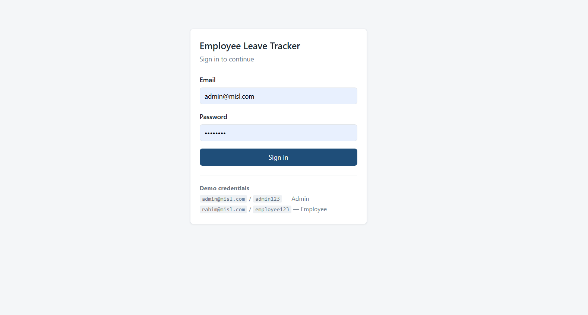
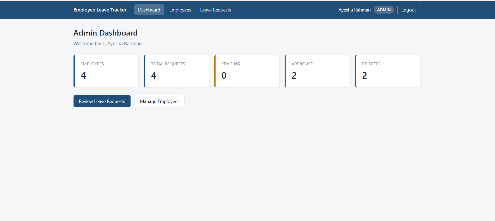
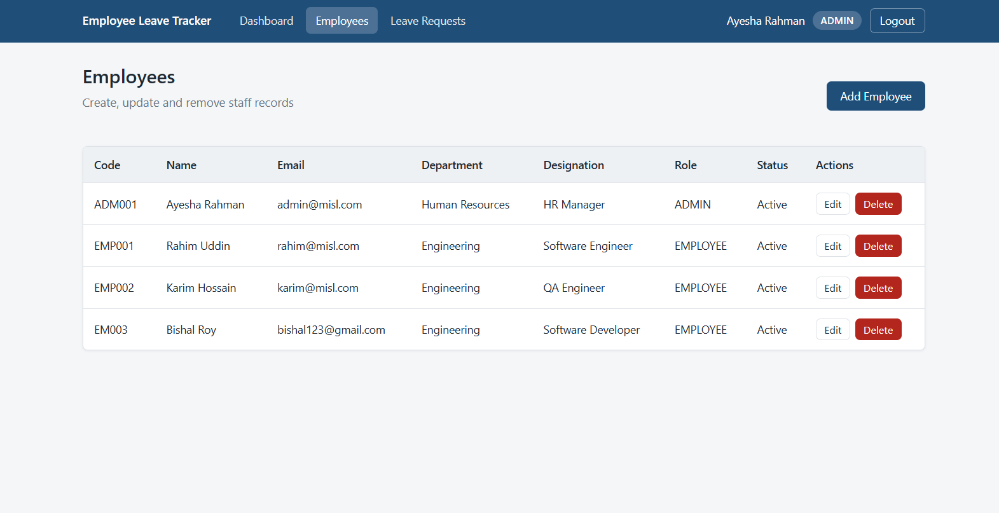
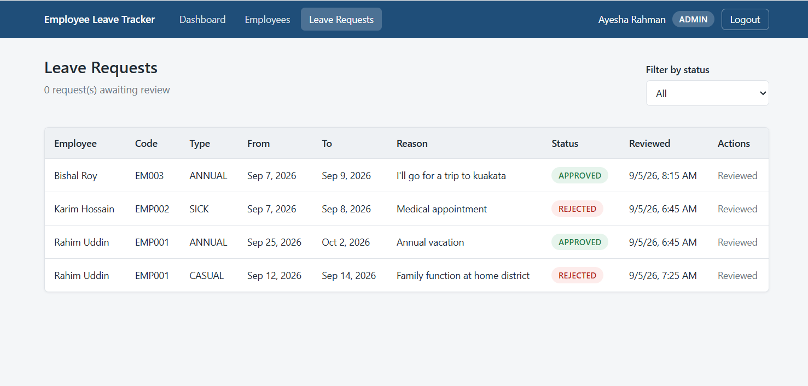
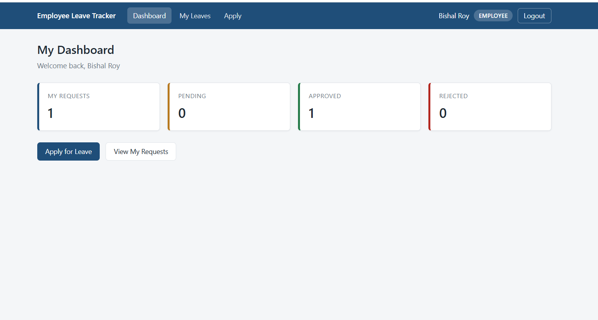
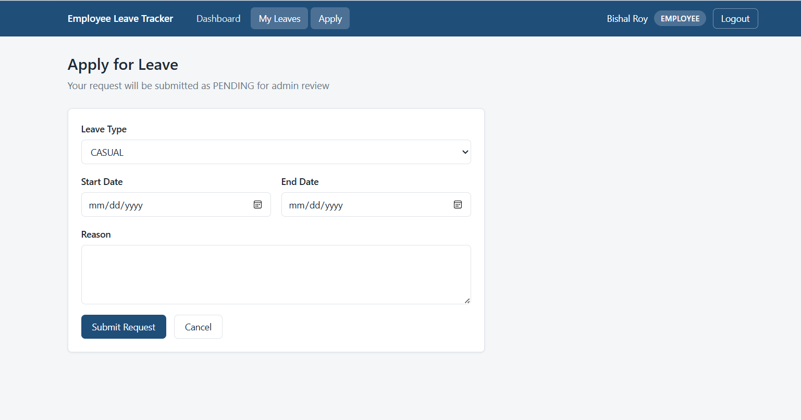
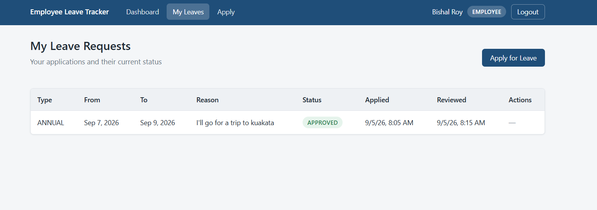

# Employee Leave Tracker

A full-stack web application for managing employee leave requests, built for the
Millennium Information Solution Ltd. fresher assessment.

Administrators manage staff records and approve or reject leave applications.
Employees apply for leave and track the status of their own requests. The whole
system — frontend, backend and database — runs with a single command:

```bash
docker compose up --build
```

---

## Screenshots

| Login | Admin Dashboard |
|---|---|
|  |  |
| Email + password, with client-side validation mirroring the server's rules. | Company-wide counters from `GET /api/dashboard/admin`. |

| Employee Management | Leave Review |
|---|---|
|  |  |
| One form handles create and edit; on edit a blank password keeps the existing one. **Show archived** reveals former staff, whose leave history is kept. | Every request in the system, filterable by status. Approve / Reject appear only on `PENDING` rows. |

| Employee Dashboard | Apply for Leave |
|---|---|
|  |  |
| Personal counters plus the remaining annual balance — scoped by the employee id inside the JWT. | Reactive form with cross-field rules: no past start date, no overlap with an existing request, and the 27-day balance checked before submitting. |

| My Leave Requests |
|---|
|  |
| The employee's own requests and their status. Withdraw is offered only while `PENDING`. |

---

## 1. Features

**Admin**

- Log in with email and password
- Dashboard with company-wide counters (employees, pending / approved / rejected)
- Full employee CRUD — create, view, update, archive (leave history is preserved)
- View every leave request in the system, filterable by status
- Approve or reject pending requests

**Employee**

- Log in with email and password
- Dashboard with personal leave counters
- Submit a leave request, with the remaining annual balance shown before applying
- View own leave requests and their status
- Withdraw a request while it is still pending

**Enforced rules**

- Passwords are stored as BCrypt hashes and are never returned by any endpoint
- An employee can only see and modify their **own** leave requests
- Only an `ADMIN` may manage employees or review leave requests
- A leave request can only be approved, rejected or edited while it is `PENDING`
- `endDate` may not be earlier than `startDate`
- **Leave may not start in the past.** Today is allowed; earlier dates are refused.
  "Today" comes from the configured company timezone (`APP_TIMEZONE`), not from the
  container — a container with no timezone runs on UTC and is a day behind during
  local early mornings
- **A new request may not overlap one the employee already holds** (approved or
  pending). Nobody can be on two leaves on the same day, and forbidding overlap is
  also what keeps the entitlement arithmetic honest — without it, 21–29 Sep plus
  25 Sep–1 Oct would charge 16 days for 11 days actually off
- **Each employee may take at most 27 leave days per calendar year.** Approved and
  pending days both count, so a queue of unreviewed requests cannot be used to slip
  past the limit. The remaining balance is shown on the employee dashboard and on
  the apply form
- A deactivated employee (`active = false`) cannot log in
- **Deleting an employee archives them; their leave history is never destroyed**, so
  HR can still trace what a former employee took
- **The last active administrator cannot be removed** — not by archiving, not by
  demotion, not by deactivation — and no admin may archive their own account

---

## 2. Tech stack

| Layer | Technology |
|---|---|
| Frontend | Angular 20 (standalone components, signals), TypeScript 5.9, Angular Router, HttpClient, Reactive Forms |
| Backend | Java 21, Spring Boot 3.5, Spring Web, Spring Security 6, Spring Data JPA, Hibernate, Bean Validation |
| Auth | JSON Web Tokens (jjwt 0.12.6), BCrypt password hashing |
| Database | PostgreSQL 16 |
| API docs | springdoc-openapi 2.8.14 — Swagger UI generated from the code |
| Testing | JUnit 5, Mockito, AssertJ (37 unit tests, no Spring context) |
| Build | Maven (backend), npm / Angular CLI (frontend) |
| Serving | nginx 1.27 (static bundle + `/api` reverse proxy) |
| Containers | Docker, Docker Compose |

---

## 3. Folder structure

```
employee-leave-tracker/
├── docker-compose.yml            # runs frontend + backend + postgres
├── .env.example                  # placeholder env values (no real secrets)
├── README.md
├── TECHNICAL_EXPLANATION.md      # how it works internally
├── API_DOCUMENTATION.md          # endpoint reference
│
├── backend/
│   ├── Dockerfile                # multi-stage: maven build -> JRE runtime
│   ├── pom.xml
│   ├── src/main/
│   │   ├── java/com/misl/leavetracker/
│   │   │   ├── LeaveTrackerApplication.java
│   │   │   ├── config/           # DataSeeder (demo data), OpenApiConfig (Swagger)
│   │   │   ├── controller/       # HTTP layer — Auth, Employee, Leave, Dashboard
│   │   │   ├── service/          # business rules and authorization
│   │   │   ├── repository/       # Spring Data JPA interfaces
│   │   │   ├── entity/           # Employee, LeaveRequest + enums
│   │   │   ├── dto/              # request/response shapes
│   │   │   ├── security/         # JWT filter, security config, UserDetails
│   │   │   └── exception/        # custom exceptions + global handler
│   │   └── resources/application.yml
│   └── src/test/java/com/misl/leavetracker/
│       ├── service/              # LeaveServiceTest, EmployeeServiceTest
│       └── security/             # JwtServiceTest
│
└── frontend/
    ├── Dockerfile                # multi-stage: node build -> nginx
    ├── nginx.conf                # SPA fallback + /api proxy
    ├── proxy.conf.json           # same job, for `ng serve` during development
    └── src/app/
        ├── app.routes.ts         # route table with guards + lazy loading
        ├── core/
        │   ├── models/           # TypeScript mirrors of the backend DTOs
        │   ├── services/         # AuthService, EmployeeService, LeaveService
        │   ├── interceptors/     # attaches the JWT to every request
        │   └── guards/           # authGuard, roleGuard, guestGuard
        ├── layout/navbar/
        └── pages/                # login, admin/*, employee/*
```

---

## 4. Architecture

A **layered monolith**. Two deployable applications and one database, with a
strict one-direction dependency chain inside the backend.

```
                    Browser  →  http://localhost:4200
                                     │
        ┌────────────────────────────┴──────────────────────────┐
        │  frontend container  (nginx)                          │
        │    /          → Angular static bundle                 │
        │    /api/*     → reverse proxy ──────────────┐         │
        └─────────────────────────────────────────────┼─────────┘
                                                      │ http://backend:8080
        ┌─────────────────────────────────────────────▼─────────┐
        │  backend container  (Spring Boot on Tomcat)           │
        │                                                       │
        │    JwtAuthenticationFilter                            │
        │            ↓                                          │
        │    @RestController   — HTTP only: URL, body, status   │
        │            ↓                                          │
        │    @Service          — business rules, ownership      │
        │            ↓                                          │
        │    JpaRepository     — data access                    │
        │            ↓                                          │
        │    Hibernate         — entity ⇄ row mapping           │
        └────────────────────────┬──────────────────────────────┘
                                 │ JDBC — jdbc:postgresql://db:5432
        ┌────────────────────────▼──────────────────────────────┐
        │  db container  (PostgreSQL 16, named volume)          │
        └───────────────────────────────────────────────────────┘
```

**Why nginx proxies `/api`:** the browser only ever talks to one origin
(`localhost:4200`) and never sees port 8080. Same origin means the browser applies
no cross-origin rules, so the project contains **no CORS configuration at all** —
one less moving part in the request path.

Each layer talks only to the one below it. A controller never touches a
repository; a repository never contains a business rule. That is what makes the
data flow traceable in one direction from URL to SQL.

---

## 5. Database overview

Two tables, one relationship.

**`employees`** — also serves as the authentication user; email is the login id.

| Column | Type | Notes |
|---|---|---|
| `id` | BIGSERIAL | primary key |
| `employee_code` | VARCHAR(20) | unique |
| `name` | VARCHAR(100) | |
| `email` | VARCHAR(150) | unique — login identifier |
| `password` | VARCHAR(100) | BCrypt hash, never exposed by the API |
| `department` | VARCHAR(100) | |
| `designation` | VARCHAR(100) | |
| `role` | VARCHAR(20) | `ADMIN` \| `EMPLOYEE` |
| `active` | BOOLEAN | inactive employees cannot log in |
| `deleted` | BOOLEAN | `not null default false` — archived (soft-deleted) employees |

**`leave_requests`**

| Column | Type | Notes |
|---|---|---|
| `id` | BIGSERIAL | primary key |
| `employee_id` | BIGINT | FK → `employees(id)` |
| `leave_type` | VARCHAR(20) | `CASUAL` \| `SICK` \| `ANNUAL` |
| `start_date` | DATE | |
| `end_date` | DATE | must be ≥ `start_date` |
| `reason` | VARCHAR(500) | |
| `status` | VARCHAR(20) | `PENDING` \| `APPROVED` \| `REJECTED` |
| `created_at` | TIMESTAMP | set on insert |
| `reviewed_at` | TIMESTAMP | null until approved/rejected |

**Relationship**

```
employees  1 ──────< N  leave_requests
```

- `LeaveRequest.employee` — `@ManyToOne(fetch = LAZY)`, the **owning side** (holds the FK)
- `Employee.leaveRequests` — `@OneToMany(mappedBy = "employee")`, with **no cascade and no
  `orphanRemoval`**, deliberately

**Employees are archived, never erased.** `DELETE /api/employees/{id}` sets
`employees.deleted = true` and `employees.active = false`; the row and every leave
request attached to it stay in the database. A leave request is a record of a decision
the company made — who asked for what, who approved it, and when — so HR must still be
able to answer "how much leave did this person take in 2026?" after they have left.

Leaving the cascade off makes the safe behaviour the *default*: if anyone ever calls
`employeeRepository.delete(...)` directly, PostgreSQL rejects it with a foreign-key
violation instead of silently destroying the history.

An archived employee is hidden from the staff list, cannot log in, and cannot be
edited. Admins can still see them with `GET /api/employees?includeArchived=true`
(the **Show archived** checkbox on the Employees page).

**Lockout protection.** Creating an `ADMIN` requires being an `ADMIN`, so losing the
last administrator would lock the application permanently — no route back in short of
editing the database by hand. Three changes are therefore refused with `400`:

- an admin archiving their **own** account
- archiving the **last active** admin
- demoting or deactivating the last active admin through `PUT`

All enums are persisted with `@Enumerated(EnumType.STRING)`, so the database stores
`'APPROVED'` rather than an ordinal index that would silently change meaning if the
enum were ever reordered.

The schema is generated from the entity classes by Hibernate
(`spring.jpa.hibernate.ddl-auto=update`), so no migration step is needed to run the
project. A production system would use `validate` plus Flyway migrations instead.

---

## 6. Authentication flow

```
 Angular login form
        │  POST /api/auth/login  { email, password }
        ▼
 AuthController → AuthService
        │
        ├─ AuthenticationManager
        │     ├─ CustomUserDetailsService loads the employee by email
        │     ├─ BCrypt compares the raw password with the stored hash
        │     └─ rejects deactivated accounts (isEnabled() == false)
        │
        └─ JwtService.generateToken()          →  200 { token, employeeId, name, email, role }
        ▼
 Angular stores the token in localStorage
        │
        │  every later request:
        │  authInterceptor adds  Authorization: Bearer <token>
        ▼
 JwtAuthenticationFilter
        ├─ verifies the HMAC-SHA256 signature and the expiry
        ├─ reloads the employee from the database
        └─ populates the SecurityContext
        ▼
 @PreAuthorize("hasRole('ADMIN')")  — role check
        ▼
 Service-layer ownership check      — "is this row yours?"
        ▼
 Controller → Service → Repository → PostgreSQL
```

**Authorization is enforced in two places, for two different reasons:**

- **Role checks** live on the controllers as `@PreAuthorize`. They are static —
  "this endpoint is for admins" — and can be decided before the method runs.
- **Ownership checks** live in the service layer, because deciding whether leave
  request #7 belongs to you requires loading row #7 first.

Both throw `AccessDeniedException`, so a single handler turns both into `403`.

The Angular route guards are a **usability** feature, not a security one: they keep
a user out of pages that would only show them errors. All real enforcement is on the
server, because anything checked only in the browser can be edited by the user.

---

## 7. API overview

Base path `/api`. Every endpoint except `/api/auth/login` requires
`Authorization: Bearer <token>`.

| Method | Endpoint | Access | Purpose |
|---|---|---|---|
| POST | `/api/auth/login` | public | Authenticate, receive a JWT |
| GET | `/api/employees` | ADMIN | List employees (`?includeArchived=true` to include archived) |
| GET | `/api/employees/{id}` | ADMIN | Get one employee |
| POST | `/api/employees` | ADMIN | Create an employee |
| PUT | `/api/employees/{id}` | ADMIN | Update an employee |
| DELETE | `/api/employees/{id}` | ADMIN | Archive an employee — leave history is kept |
| GET | `/api/leaves` | ADMIN | Every leave request, newest first |
| GET | `/api/leaves/my` | authenticated | The caller's own requests |
| GET | `/api/leaves/{id}` | ADMIN or owner | One leave request |
| POST | `/api/leaves` | authenticated | Submit a request (always `PENDING`) |
| PUT | `/api/leaves/{id}` | owner, while `PENDING` | Edit a request |
| DELETE | `/api/leaves/{id}` | ADMIN, or owner while `PENDING` | Withdraw a request |
| PATCH | `/api/leaves/{id}/approve` | ADMIN | `PENDING` → `APPROVED` |
| PATCH | `/api/leaves/{id}/reject` | ADMIN | `PENDING` → `REJECTED` |
| GET | `/api/dashboard/admin` | ADMIN | Company-wide counters |
| GET | `/api/dashboard/employee` | authenticated | The caller's own counters |

**Status codes**

| Code | Meaning |
|---|---|
| 200 | Successful GET / PUT / PATCH |
| 201 | Resource created |
| 204 | Deleted, no body |
| 400 | Validation failure, or an illegal state change |
| 401 | Missing, invalid or expired token — or wrong login credentials |
| 403 | Authenticated, but not permitted |
| 404 | No such id |
| 409 | Duplicate email or employee code |

Every error response uses the same JSON shape — see `API_DOCUMENTATION.md`.

### Interactive API docs (Swagger UI)

With the backend running:

| | URL |
|---|---|
| Swagger UI | **http://localhost:8080/swagger-ui.html** |
| Raw OpenAPI 3 document | http://localhost:8080/v3/api-docs |

Nothing in it is hand-written — springdoc scans the controllers and DTOs at startup,
so the endpoint list, request bodies, response schemas and field types are generated
from the code and cannot drift out of date.

**To try the protected endpoints:**

1. Expand `POST /api/auth/login` → **Try it out** → send
   `{"email":"admin@misl.com","password":"admin123"}`
2. Copy the `token` from the response
3. Click **Authorize** (top right), paste the token, **Authorize**
4. Every request from then on carries `Authorization: Bearer <token>`

Log in as `rahim@misl.com` / `employee123` instead and the ADMIN-only endpoints
return **403** — the role rules are enforced here exactly as they are for the
Angular app.

> Note this is served by the backend on port **8080**, not through nginx on 4200 —
> nginx only proxies `/api`. A production deployment would normally switch springdoc
> off outside development with `springdoc.api-docs.enabled=false`.

---

## 8. Docker setup

Three containers on one Docker network, defined in `docker-compose.yml`.

| Service | Image | Host port | Notes |
|---|---|---|---|
| `frontend` | built from `frontend/Dockerfile` | `4200 → 80` | nginx serving the Angular bundle |
| `backend` | built from `backend/Dockerfile` | `8080 → 8080` | Spring Boot fat jar on a JRE |
| `db` | `postgres:16-alpine` | not published | reachable only inside the network |

**Both Dockerfiles are multi-stage.** The backend builds with Maven + JDK and ships
only the jar on a JRE base. The frontend builds with Node and ships only the compiled
static files on nginx — the final image contains no Node runtime and no `node_modules`.

**Service names are hostnames.** The backend connects to
`jdbc:postgresql://db:5432/...` and nginx proxies to `http://backend:8080` —
`db` and `backend` are the service names, resolved by Docker's internal DNS. Using
`localhost` would make each container look inside itself.

**Startup order is gated by a healthcheck.** Postgres takes a few seconds to become
ready, so the backend waits on `condition: service_healthy` rather than merely on
the container having started.

**Persistence.** The `postgres-data` named volume keeps the database across
`docker compose down`. Use `docker compose down -v` to wipe it and re-seed.

**Configuration** is entirely through environment variables, each with a development
default of the form `${VAR:-default}`, so the project runs with no `.env` file while
still allowing every value to be overridden. Copy `.env.example` to `.env` to change
any of them — `.env` is git-ignored, and **no real secret is committed to this
repository**.

| Variable | Default | Purpose |
|---|---|---|
| `POSTGRES_DB` | `leave_tracker` | Database name |
| `POSTGRES_USER` | `postgres` | Database user |
| `POSTGRES_PASSWORD` | `postgres` | Database password |
| `SPRING_DATASOURCE_URL` | `jdbc:postgresql://db:5432/leave_tracker` | JDBC URL — note the host is the **service name** `db` |
| `JWT_SECRET` | a development placeholder | HMAC-SHA256 signing key; must be ≥ 32 characters |
| `JWT_EXPIRATION_MS` | `86400000` (24 h) | Token lifetime |
| `LEAVE_ANNUAL_ENTITLEMENT_DAYS` | `27` | Leave days per employee per calendar year |
| `APP_TIMEZONE` | `Asia/Dhaka` | The company's timezone — decides what "today" is |
| `TZ` | `Asia/Dhaka` | JVM default zone, so log and audit timestamps agree |

The last one is a company policy rather than a constant, so it is configurable instead
of compiled in — `LEAVE_ANNUAL_ENTITLEMENT_DAYS=20 docker compose up` changes the
limit without touching any code.

---

## 9. How to run

### With Docker (recommended)

Requires Docker Desktop only — no Java, Node or PostgreSQL on the host.

```bash
git clone https://github.com/IronDigger098/Employee-Leave-Tracker-Assignment-.git
cd Employee-Leave-Tracker-Assignment-
docker compose up --build
```

The first build takes several minutes while base images and dependencies download.
When you see `Started LeaveTrackerApplication`, open:

- **Application:** http://localhost:4200
- **API:** http://localhost:8080/api

To stop:

```bash
docker compose down        # keeps the database
docker compose down -v     # also deletes the data and re-seeds on next start
```

To inspect the database:

```bash
docker compose exec db psql -U postgres -d leave_tracker
```

### Without Docker (local development)

Requires JDK 21, Maven 3.9+, Node 22+, and a PostgreSQL 16 instance.

```bash
# 1. database
docker run --name leave-db -e POSTGRES_DB=leave_tracker -e POSTGRES_USER=postgres \
  -e POSTGRES_PASSWORD=postgres -p 5432:5432 -d postgres:16-alpine

# 2. backend  (http://localhost:8080)
cd backend
mvn spring-boot:run

# 3. frontend (http://localhost:4200)
cd frontend
npm install
npm start
```

`proxy.conf.json` forwards `/api` from the dev server to `localhost:8080`, so the
browser still sees a single origin and no CORS setup is needed.

### Running the backend tests

```bash
cd backend
mvn test
```

Or, without installing Maven:

```bash
docker run --rm -v "$(pwd)/backend:/app" -w /app maven:3.9-eclipse-temurin-21 mvn test
```

37 tests covering the business rules that no annotation can express — the date-range
rule, the 27-day entitlement, overlap rejection, the `PENDING`-only state transitions
and the ownership checks; the archiving rules, including a test that fails loudly if
anyone ever swaps the soft delete back for a real one; and signing, expiry and
tamper-detection in `JwtService`.

They are plain unit tests with Mockito mocks, **not** `@SpringBootTest`: no Spring
context starts and no database is required, so they run in milliseconds on a
machine with nothing installed but a JDK. The Docker image build uses
`-DskipTests` because an image build is an artifact step, not a CI step.

---

## 10. Demo credentials

Seeded automatically on first start, **only when the database is empty**
(`DataSeeder` checks the row count first, so restarting never duplicates data).

| Role | Name | Email | Password |
|---|---|---|---|
| ADMIN | Bishal Roy | `admin@misl.com` | `admin123` |
| EMPLOYEE | Rahim Uddin | `rahim@misl.com` | `employee123` |
| EMPLOYEE | Karim Hossain | `karim@misl.com` | `employee123` |

> These are **development / demo credentials only**. They exist so the application
> can be evaluated without manual setup, and would never ship in a real deployment.
> They are stored as BCrypt hashes like any other password — the seeder has no
> special path that bypasses hashing.

Three sample leave requests are also seeded, one in each status, so every dashboard
counter and every status badge has something to show on a fresh install.

---

## 11. Further reading

- **`TECHNICAL_EXPLANATION.md`** — request flow, layer responsibilities, JWT
  internals, JPA/Hibernate behaviour, Docker architecture
- **`API_DOCUMENTATION.md`** — every endpoint with example requests and responses
